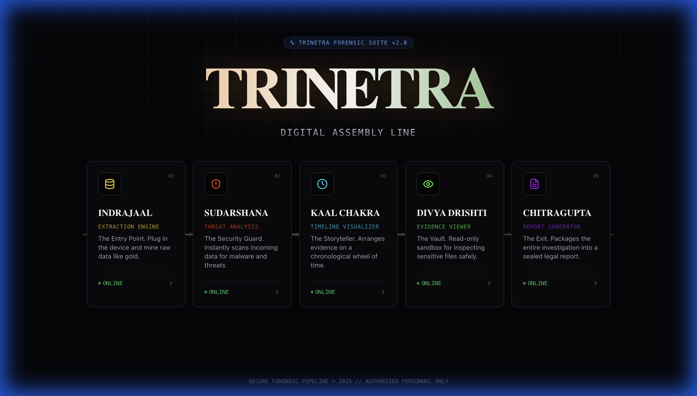
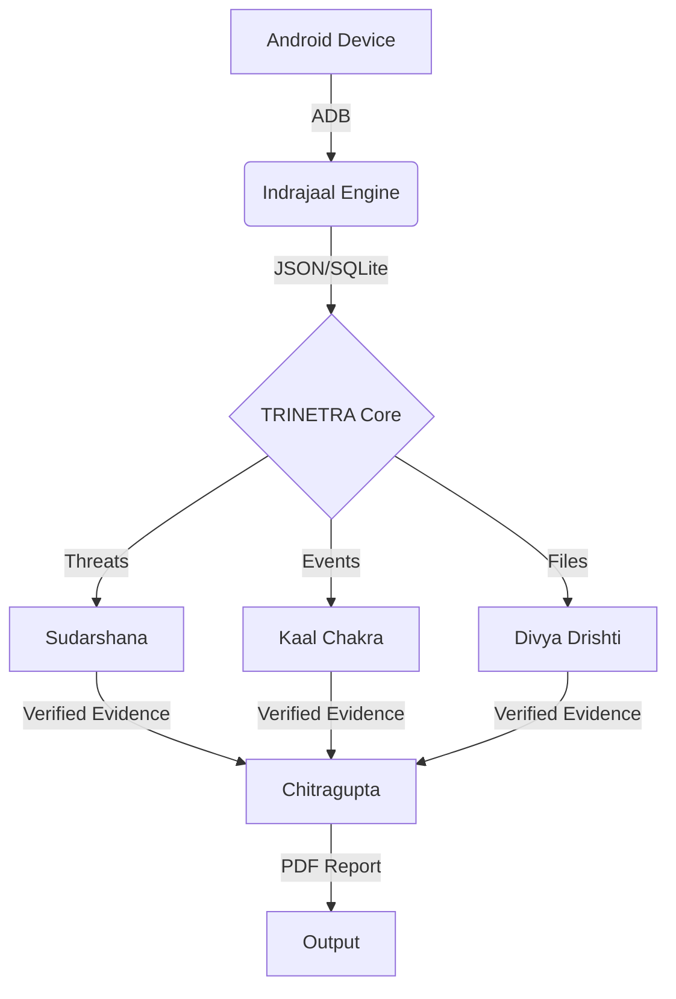

# 🇮🇳 TRINETRA: Digital Assembly Line
> *The All-Seeing Eye of Digital Forensics*

<div align="center">



[](./LICENSE)
[](https://reactjs.org/)
[](https://www.python.org/)
[](https://vitejs.dev/)
[](https://tailwindcss.com/)

**The ultimate 5-Stage Digital Forensic Pipeline for Law Enforcement & Cybersecurity Professionals.**
Inspired by ancient Vedic wisdom, built for modern cyber warfare.

[⚡ Quick Start](#-quick-start) • [🛡️ Modules](#-divine-modules) • [📐 Architecture](#-architecture) • [🚀 Deployment](#-deployment)

</div>

---

## 🦅 Overview

**TRINETRA** (Sanskrit: *Three Eyes*) is a state-of-the-art digital forensics suite designed to streamline the investigation lifecycle. From real-time extraction to legally admissible reporting, every stage is governed by a specialized "Divine Module".

It replaces fragmented tools with a single **Digital Assembly Line**, ensuring evidence integrity through cryptographic verification (SHA-256 & RSA-4096).

---

## 🛡️ Divine Modules

TRINETRA allows investigators to seamless flow through 5 stages of investigation:

| Stage | Module Name | Divine Function | Capabilities |
| :--- | :--- | :--- | :--- |
| **01** | **INDRAJAAL** | *The Cosmic Net* | **Extraction Engine**. Pulls SMS, Call Logs, Contacts, and Media from Android devices via ADB. |
| **02** | **SUDARSHANA** | *The Discus* | **Threat Intelligence**. Real-time malware scanning, packet sniffing, and "Chakra Radar" threat visualization. |
| **03** | **KAAL CHAKRA** | *Wheel of Time* | **Timeline Analysis**. Merges all evidence (Calls, SMS, GPS) into a single interactive chronological stream. |
| **04** | **DIVYA DRISHTI**| *Divine Vision* | **Evidence Viewer**. Sandbox for analyzing images, videos, and documents without altering metadata. |
| **05** | **CHITRAGUPTA** | *The Scribe* | **Reporting**. Generates tamper-proof PDF reports with Chain-of-Custody verification and Karma Seals. |

---

## 📸 Visual Tour

### 1. The Dashboard (Digital Assembly Line)
The central command center providing instant access to all forensic modules.
*(See banner image above)*

### 2. Indrajaal (Extraction)
Live device telemetry and one-click dump of critical partitions.

### 3. Chitragupta (The Final Report)
Automated generation of court-ready documentation.

---

## 📐 Architecture

The system uses a **Hybrid Architecture** to ensure speed and security:

- **Frontend**: React + TypeScript + Vite (Lightning fast UI)
- **Backend / Engine**: Python (FastAPI + ADB + PyTorch for AI analysis)
- **Communication**: REST API + WebSockets (Real-time updates)
- **Security**: Local-first processing (Data never leaves the machine unless configured)



---

## ⚡ Quick Start

### Prerequisites
- **Python 3.10+**
- **Node.js 18+**
- **ADB** (`sudo apt install adb` or brew)

### 1. Clone & Setup
```bash
git clone https://github.com/utxdev/xaenithra-ps6-investigation.git
cd xaenithra-ps6-investigation
```

### 2. Launch the Suite
We provide a unified launcher script that starts all services:
```bash
# Install dependencies and run
pip install -r requirements.txt
python run_trinetra.py
```

### 3. Access
Open your browser to: **`http://localhost:8082`**

---

## 🚀 Deployment

### Public Tunneling (Demo Mode)
To show this to clients remotely without deploying to a server:
```bash
cd chitragupta/frontend/deploy
./start_tunnel.sh
```
*This creates a `https://trinetra-forensics.loca.lt` link accessible from anywhere.*

### Production Build
The frontend is optimized for static deployment (Vercel/Netlify/GitHub Pages):
```bash
cd chitragupta/frontend
npm run build
# Output is in /dist
```

---

## ⚖️ Legal & Compliance
- **Chain of Custody**: Maintained via Merkle Trees.
- **Hashing**: All evidence is hashed (SHA-256) upon extraction.
- **Admissibility**: Reports are designed to meet ISO/IEC 27037 guidelines for digital evidence.

---

<div align="center">

**Made with 🇮🇳 for the Guardians of Cyberspace**
*© 2025 UTXDEV Team. All Rights Reserved.*

</div>
